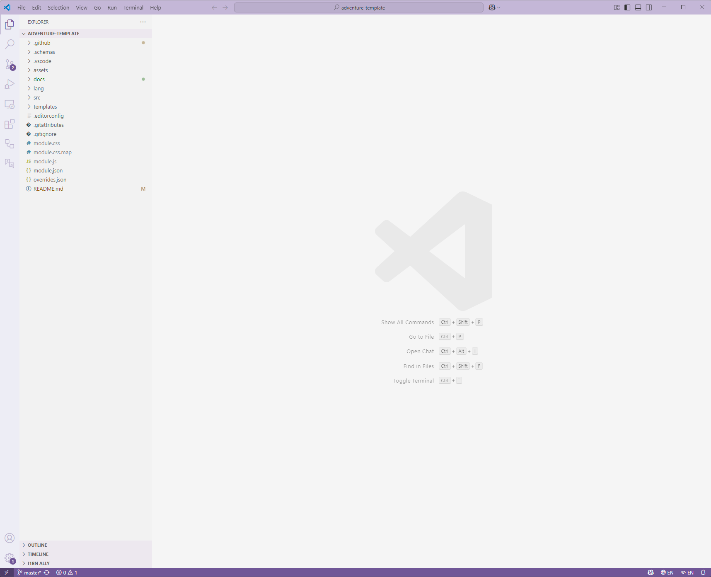

# A non technical guide to Adventure Template!

If you're reading this you probably didn't manage to make much sense of
the rather technical [README](../README.md).
That's okay! This document will (try to) guide you step-by-step through
the process of setting up Foundry, this template and all related bits
and bops.

Table of contents:

- [prerequisites](#prerequisites)
- [configuring the template](#configuring-the-template)

## Prerequisites

This adventure requires a couple things installed and running to fully
take advantage of the features it provides.

### Visual Studio Code

While you _could_ perfectly do without this software, the template does
it's best to automate everything for this editor specifically. Think of
Visual Studio Code (often referred to as `code`) as a specialized
"notepad" that gives you pretty colours, helps you with getting code
right and points out mistakes and even help you fix them.

You can download Code from [it's website](https://code.visualstudio.com/). We'll get to setting it up for you in a few steps, so for now
install it and try opening to see if everything works.

### Bun

Foundry, this template (and a surprisingly large part of the internet)
runs on a programming language called JavaScript. `Bun` is a modern,
fast JavaScript runtime and package manager that can execute scripts
and manage dependencies for your project.

To build your adventure code, macros and styling we need Bun installed
on your computer.

Head over to [their website](https://bun.sh/) and follow the installation
instructions for your platform (Windows, macOS, or Linux). Once installed,
we can start installing the template itself!

### The template

Most likely you'll be reading this over on GitHub (if not, head over [here](https://github.com/dealloc/adventure-template)).

You have 2 options for getting started.

- You can create a repository for this template by using the `Use this template` button in the top right ([this article](https://docs.github.com/en/repositories/creating-and-managing-repositories/creating-a-repository-from-a-template) provides an in-depth guide), note that requires a GitHub Account and _some_ knowledge on how to use Git.
- You can download the repository as a ZIP file on your computer by clicking on the green `< > Code` button and then the `Download ZIP` button at the bottom of the opened dropdown. Once you unpack this you have a local copy on your computer.

Once you have a copy, either by cloning your repository or extracting the downloaded ZIP,
we can get started setting up your environment for writing your adventure.

First, we'll need to move the template to the right location. Foundry
stores it's modules under `<FOUNDRY_PATH>/Data/modules`.
On Foundry's homepage (the one with the worlds, systems and modules)
you can click the settings, and from there you should find a field
called `User Data Path`, that path is where Foundry stores your modules.

Open that folder, and you should find the following folders:

```
- Config
- Data
- Logs
```

Open the `Data` folder, and you should find a `modules` folder in it.
In _that_ folder (`Data/modules`) drop your template folder, leaving you with something like
`Data/modules/adventure-template` where `adventure-template` can be the name of your adventure (in all lowercase, and replacing any spaces with `-`, so `Adventure Template` -> `adventure-template`).

Once we have this set up, let's open this folder in Visual Studio Code
(you can do this by going to `File -> Open folder` and selecting the folder
we set up above).

## Configuring the template

### Setting up Visual Studio Code

Once set up and Visual Studio Code is open with our folder, we should see something similar to this:


First of all, let's install the extensions this template
uses to make your life easier. [Install a VS Code extension](https://code.visualstudio.com/docs/getstarted/extensions#_install-a-vs-code-extension)
walks you through installing them.

If you type `@recommended` in the search bar you should see
the extensions I configured, click install on both.

The recommended extensions for this template are:
- **EditorConfig** - Helps maintain consistent coding styles
- **i18n Ally** - Helps with internationalization if you add multiple language support
- **GitHub Actions** - Provides syntax highlighting and validation for the CI/CD workflows

These extensions are optional but make development easier.

### Installing dependencies

With that out of the way, let's install the dependencies
for building scripts and styles. Open a terminal (`Terminal -> New Terminal` at the top of the screen).

Then type in the following and press enter:

```bash
bun install
```

This command installs everything the template needs to compile scripts, macros and styles. If you
see an error that `bun` is not recognized, you need
to verify you installed Bun correctly (see [Prerequisites](#prerequisites)).

### Building scripts

Once installed, run the following command in the same terminal:

```bash
bun run build
```

As you may have guessed, this will "build" the project
which involves compiling all scripts and styles. You should see newly created files in a `dist` folder, that's normal! These files are re-generated every time we run the build.

Now, every time we run `bun run build` it builds all our scripts and styles, so we can use them
in Foundry. But having to constantly switch back and forth and running that command is tedious,
fortunately we have an alternative:

```bash
bun start
```

This starts a development server that will "watch" your files and folders for changes, and
automatically rebuild when you save a file, isn't that handy!

### Changing the name (and ID)

Every package, adventure and so forth has an 'ID' in Foundry.
When you use this template, it's by default set to `adventure-template` in a couple places,
and I recommend updating this, since you can't have 2 packages with the same ID (so someone else
also using this ID would break your setup!).

I've described where you have to update this in the [README](../README.md#getting-started).

### Configuring Foundry

Foundry actually has a built-in way to automatically update your journals when you update the styles (and to some extend scripts), but it's not enabled by default.

In Foundry's settings screen, scroll all the way to the bottom and find `Hot reload package files` and enable this, don't forget to save the settings.

### Testing our adventure

With that out of the way, it's finally time to test your adventure in Foundry!
If you had Foundry open during any of the previous steps, close it and re-open Foundry since Foundry only reads your `module.json` file on startup.
You don't have to restart Foundry for other changes, so don't worry about that.

First, verify that your adventure is shown in your module list under the name you have given it in `module.json` (if you haven't changed it, it's `Adventure Template`).
If it's there, you can go ahead and create a new world and enable the module and you are good to go.

### Writing your adventure

The [README](../README.md) describes all the features you get out of the box from this template.
For actually creating your adventure (writing journals, monsters, ...) head over to [Foundry's documentation](https://foundryvtt.com/kb/).
The readme lists a few articles you should definitely read to get started, as actually helping you manage compendiums is out of scope for this template's documentation.

### Licensing

One last thing before you go writing your own adventures, it's important to note that this template comes with a [license](../LICENSE.md).
Basically a legal document that tells you what you can and can't do (and yes, it applies even if you modify this template). If you are making an adventure you are distributing for free,
you are simply required to acknowledge that you used code written by me (simply something like `uses adventure-template by @dealloc` is sufficient) in a place that your players and other people can see
easily (such as the players guide).

If you are planning to use this template to make a commercial product (aka you have financial gain from the adventures and/or content created using this template and/or code) you must use a commercial license.

You can see more information in the [README](../README.md#licensing) and [LICENSE.md](../LICENSE.md) for details.
